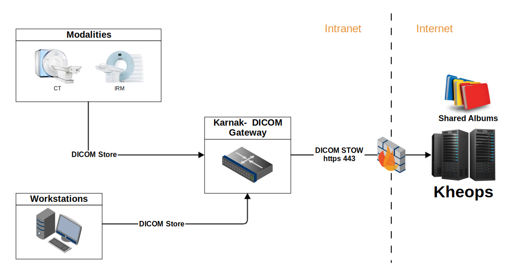
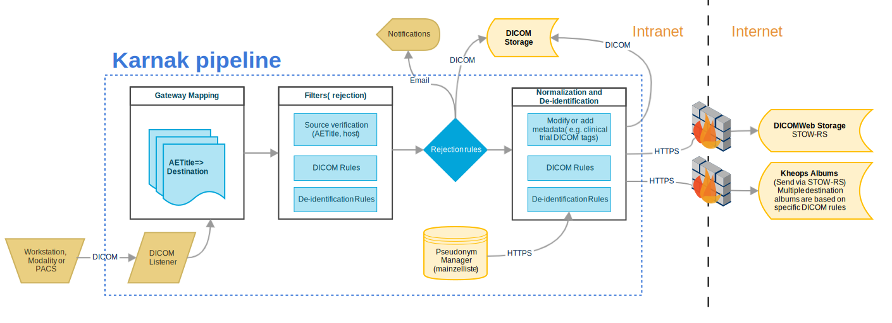

Karnak is a DICOM gateway for data de-identification and DICOM attribute normalization.

Karnak manages a continuous DICOM flow with a DICOM listener as input and a DICOM and/or DICOMWeb as output.

# Application Features

## Gateway
- Allows to build mapping between a source and one or more destinations
- Each destination can be DICOM or DICOMWeb
- Filter the images providers by AETitle and/or hostname (ot ensure the authenticity of the source)

## de-identification
- Each destination can be configured with a specific de-identification profile
- Configuration for sending only specific SopClassUIDs
- [Build your own de-identification profile](https://github.com/OsiriX-Foundation/karnak-docker/blob/master/profileExample/README.md) or add modifications to the basic DICOM profile
- Import and export the de-identification profiles

# Build Karnak

Prerequisites:
- JDK 14
- Maven 3
- Package dcm4che20
- Package weasis-dicom-tools

Use the following commands to build the two dependencies (dcm4che20 and weasis-dicom-tools):

##### dcm4che20

1. `git clone https://github.com/nroduit/dcm4che20.git`
1. `git checkout image`
1. `mvn source:jar install`

##### weasis-dicom-tools

1. `git clone https://github.com/nroduit/weasis-dicom-tools.git`
1. `git checkout dcm4che6`
1. `mvn clean install`

##### Karnak

Execute the maven command `mvn clean install` in the root directory of the project.

# Run Karnak

To launch the UI, execute the maven command `mvn spring-boot:run -f mvc` in the root directory of the project.

# Debug Karnak

## Debug in IntelliJ

 - Launch the docker needed for Karnak (see "Configure locally Mainzelliste and Postgres database with docker-compose")
 - Enable Spring and Spring Boot for the project
 - Create a Spring Boot launcher from main of StartApplication.java
    - Working Directory must be the mvc directory
    - In VM Options, add `-Djava.library.path="/tmp/dicom-opencv"`
    - In Environment variables, add the following values. 
    The following values work with our default configuration define with docker used for the development (see: "Configure locally Mainzelliste and Postgres database with docker-compose") :
        - `DB_PASSWORD=5!KAnN@%98%d`
        - `DB_PORT=5433`
        - `DB_USER=karnak`
        - `DB_NAME=karnak`
        - `DB_HOST=localhost`
        - `MAINZELLISTE_HOSTNAME=localhost`
        - `MAINZELLISTE_HTTP_PORT=8083`
        - `MAINZELLISTE_ID_TYPES=pid`
        - `MAINZELLISTE_API_KEY=changeThisApiKey`
        - `KARNAK_HMAC_KEY=changeThisHmacKey`
        - `KARNAK_ADMIN=admin`
        - `KARNAK_PASSWORD=admin`
        - `KARNAK_WEB_PORT=8081`
        - `KARNAK_ALLFILE_LOGS_MAX_FILE_SIZE=1GB`
        - `KARNAK_ALLFILE_LOGS_MAX_HISTORY=2`
        - `KARNAK_ALLFILE_LOGS_TOTAL_SIZE_CAP=20GB`

    Note: the tmp folder must be adapted according to your system and the dicom-opencv must the last folder.
<!--
## Debug in Eclipse - obsolete

 - Configure locally mainzelliste and Postgres database (see below)
 - From Eclipse Marketplace: install the latest Spring Tools
 - Create a Spring Boot App launcher from main of SartApplication.java
    - Copy the KARNAK environment variables in docker/.env and paste into the Environment tab of the launcher    
    - In the Arguments tab of the launcher, add in VM arguments: `-Djava.library.path="/tmp/dicom-opencv"`    
    Note: the tmp folder must be adapted according to your system and the dicom-opencv must the last folder.
-->
## Configure locally Mainzelliste and Postgres database with docker-compose

Minimum docker-compose version: **1.22**

- Go in the `docker` folder located in the root project folder.
- To configure the docker used by karnak, please refer to this links.
    - [docker hub postgres](https://hub.docker.com/_/postgres)
    - [docker hub mainzelliste](https://hub.docker.com/r/osirixfoundation/karnak-mainzelliste)
- Adapt the values if necessary
- Execute command:
    - start: `docker-compose up -d`
    - show the logs: `docker-compose logs -f`
    - stop: `docker-compose down`

# Docker

Minimum docker version: **19.03**

## Build with Dockerfile

Go on the root folder and launch the following command:

`docker build -t karnak/locally:latest .`

Run Karnak: `docker run -it -p8081:8081 -p11119:11119 karnak/locally:latest`

## Run image from Docker Hub

See [documentation](https://github.com/OsiriX-Foundation/karnak-docker)

## Docker environment variables

`DB_USER`

User of the karnak database (optional, default is `karnak`).

`DB_USER_FILE`

User of the karnak database via file input (alternative to `DB_USER`).

`DB_PASSWORD`

Password of the karnak database (optional, default is `karnak`).

`DB_PASSWORD_FILE`

Password of the karnak database via file input (alternative to `DB_PASSWORD`).

`DB_NAME`

Name of the karnak database (optional, default is `karnak`).

`DB_NAME_FILE`

Name of the karnak database via file input (alternative to `DB_NAME`).

`DB_HOST`

Hostname/IP Address of the PostgreSQL host. (optional, default is `localhost`).

`DB_PORT`

Port of the PostgreSQL host (optional, default is `5432`)

`MAINZELLISTE_HOSTNAME`

Hostname/IP Address of the Mainzelliste host. (optional, default is `localhost`).

`MAINZELLISTE_HTTP_PORT`

Port of the Mainzelliste host. (optional, default is `8080`).

`MAINZELLISTE_ID_TYPES`

Type of pseudonym to be created and sent.

`MAINZELLISTE_API_KEY`

The api key used to connect to Mainzelliste host (optional, default is `undefined`)

`KARNAK_HMAC_KEY`

The key used for the HMAC. This HMAC will be used for all the hash created by karnak

`KARNAK_HMAC_KEY_FILE`

The key used for the HMAC via file input. (alternative to `KARNAK_HMAC_KEY`).

`KARNAK_LOGIN_ADMIN`

Login used for Karnak. (optional, default is `admin`).

`KARNAK_LOGIN_PASSWORD`

Password used for Karnak. (optional, default is `undefined`).

`KARNAK_LOGIN_PASSWORD_FILE`

Password used for Karnak via file input. (alternative to `KARNAK_LOGIN_PASSWORD`).

`KARNAK_WAIT_FOR`

List of service to wait before start KARNAK.

`KARNAK_LOGS_MAX_FILE_SIZE`

Allows you to configure the maximum size of a single file for general logs. (default is `1GB`).

`KARNAK_LOGS_MAX_HISTORY`

Allows you to configure how many days you want to log for the general logs. (default is `2`).

`KARNAK_LOGS_TOTAL_SIZE_CAP`

Allows you to configure the maximum size of all log files for general logs. (default is `20GB`).

# Architecture

This project provides two modules:
 - karnak-data: the data model for persistence of the gateway configuration 
 - karnak-mvc: the services and UI for updating the data model

# Workflow

# Pipeline

