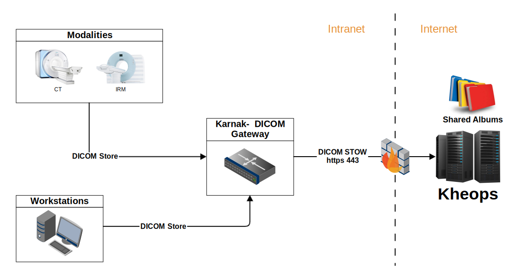
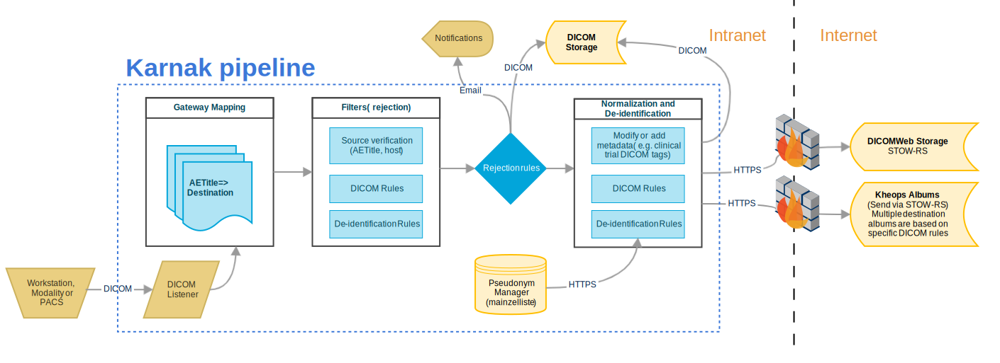

[](https://opensource.org/licenses/EPL-2.0) [](https://opensource.org/licenses/Apache-2.0)  

[](https://sonarcloud.io/component_measures?id=karnak) [](https://sonarcloud.io/component_measures?id=karnak&metric=coverage) [](https://sonarcloud.io/component_measures?id=karnak) [](https://sonarcloud.io/component_measures?id=karnak) [](https://sonarcloud.io/component_measures?id=karnak) [](https://sonarcloud.io/dashboard?id=karnak)

Karnak is a DICOM gateway designed for data de-identification and DICOM attribute normalization. It manages continuous DICOM data streams, functioning as a DICOM listener for input and supporting both DICOM and DICOMWeb formats for output.

In practice, Karnak receives DICOM studies from one or more **sources** (modalities, PACS, workstations…), applies a configurable **de-identification / tag-morphing profile**, and forwards the result to one or more **destinations** over DICOM or DICOMWeb (STOW-RS). Everything is configured and monitored from a web interface.

For detailed usage instructions, refer to the [Karnak User Guide](https://osirix-foundation.github.io/karnak-documentation/).

# Application Features

## Gateway

- Allow to have multiple destinations for one source. 
- A destination can be DICOM or DICOMWeb.
- Provides filtering options for image providers by AE Title and/or hostname to ensure source authenticity.
- Provides filtering options for SOP Class UID to send only specific SOP Class UIDs.
- Use expressions to filter images from the DICOM tag values.

## De-identification

- Each destination can be configured with a specific de-identification profile
- [Build your own de-identification profile](https://osirix-foundation.github.io/karnak-documentation/en/profiles)
- Import and export the de-identification profiles to share them with other users.

# Getting started

You don't need to build Karnak from source to use it. Pick the option that fits your needs:

| I want to… | Use | Details |
|------------|-----|---------|
| Run Karnak in production | **Docker** | [karnak-docker](https://github.com/OsiriX-Foundation/karnak-docker) — Postgres + Redis, the recommended setup |
| Try Karnak quickly on a single machine | **Portable package** | Self-contained, embedded database, no external services — see [Run portable package](#run-portable-package) |
| Contribute to / develop Karnak | **Build from source** | See [Build Karnak](#build-karnak) and [Debug Karnak](#debug-karnak) |

## Accessing Karnak

Once Karnak is running, with the default configuration:

- **Web interface**: <http://localhost:8081>
- **Default credentials**: user `admin`, password `karnak` (change these in production via `KARNAK_ADMIN` / `KARNAK_PASSWORD`)
- **DICOM listener**: AE Title `KARNAK-GATEWAY`, port `11119` (the portable package uses `11112`) — point your modality or PACS here to send studies to Karnak

The web port (`KARNAK_WEB_PORT`), the listener AE Title (`DICOM_LISTENER_AET`) and port (`DICOM_LISTENER_PORT`), as well as the sources and destinations, are all configurable; see the [Karnak User Guide](https://osirix-foundation.github.io/karnak-documentation/).

# Build Karnak

Prerequisites:
- JDK 25
- Maven 3.3+

## Build for docker image

Execute the maven command `mvn clean install -P production` in the root directory of the project.

## Build for portable package

Execute the maven command `mvn clean install -Pportable` in the root directory of the project.

Note: on Windows the bash.exe must be specified: `mvn clean install -Pportable -Dbash.executable=${env.LOCALAPPDATA}\Programs\Git\bin\bash.exe`

# Run Karnak

## Run with docker
To configure and run Karnak with docker, see [karnak-docker](https://github.com/OsiriX-Foundation/karnak-docker). This is the recommended setup for production.

## Run portable package
After building the portable package (see [Build for portable package](#build-for-portable-package)), go into the generated folder `build-portable/target/karnak-<os>-jdk<version>-<karnak-version>` (for example `karnak-linux-x86-64-jdk25-...`) and launch the executable `run.sh` (Linux or macOS) or `run.bat` (Windows).

Settings such as the web port and the DICOM listener can be adjusted in the `run.cfg` file located next to the executable.

Then open <http://localhost:8081> and log in (see [Accessing Karnak](#accessing-karnak)).

Note: this portable package runs an embedded database (H2) in file mode, and the Redis server is replaced by an in-memory cache. For intensive use, it's recommended to run Karnak with docker and a Postgres database.

# Debug Karnak

## Debug in IntelliJ

- Launch the components needed by Karnak (see below "Run locally the database and the cache with docker")
- Run `mvn clean install` once before the first debug session. Besides building the project, this copies
  the native OpenCV library into `target/classes/lib/<os>-<cpu>/` — it is loaded at startup by the DICOM
  gateway, and the application fails with "Cannot register DICOM native librairies" if it is missing.
- Enable Spring and Spring Boot for the project
- Create a Spring Boot launcher from the main of `KarnakApplication.java`
    - Working Directory must be the project root directory (the folder containing `pom.xml`)
    - In VM Options:
      - Add `-Djava.library.path="/tmp/dicom-opencv"`. Note: the tmp folder must be adapted according to your system and `dicom-opencv` is mandatory as the last folder.
      - Optional: Add `-Dvaadin.productionMode=true` to enable production mode
    - In Environment variables, add the following values. The following values work with our default
      configuration defined with docker used for the development (see: "Run locally the database and the cache with docker") :
        - Mandatory:
            - `ENVIRONMENT=DEV`
            - `DB_ENCRYPTION_KEY=fsGuSZRIEr$HwlTDPglZg*Vl7WtJCZz6RLvqoMKWSA!`
        - Optional:
            - `DB_PASSWORD=karnak`
            - `DB_PORT=5433`
            - `DB_USER=karnak`
            - `DB_NAME=karnak`
            - `DB_HOST=localhost`
            - `KARNAK_ADMIN=admin`
            - `KARNAK_PASSWORD=karnak`
            - `IDP=undefined`
            - `OIDC_CLIENT_ID=undefined`
            - `OIDC_CLIENT_SECRET=undefined`
            - `OIDC_ISSUER_URI=undefined`
            
## Run locally the database and the cache with docker

- Go in the `docker` folder located in the root project folder.
- To configure third-party components used by karnak, please refer to these links:
    - [docker hub postgres](https://hub.docker.com/_/postgres)
- Adapt the values if necessary (copy `.env.example` into `.env` and modify it)
- Execute command:
    - start: `docker compose up -d`
    - show the logs: `docker compose logs -f`
    - stop: `docker compose down`

# Code formatting

Two formatting plugins are bound to the Maven build and run automatically during `mvn install`:

- **[spring-javaformat](https://github.com/spring-io/spring-javaformat)** — applies the Spring Java
  code style (indentation, spacing, line wrapping). It does not modify imports.
- **[spotless](https://github.com/diffplug/spotless)** — removes unused imports, sorts them
  (static imports first, then a blank line, then the rest) and enforces the EPL-2.0 OR Apache-2.0
  license header on every Java file. It neither rejects nor expands wildcard imports
  (`import x.y.*;`) — it leaves them untouched.

CI and Sonar flag any style violation, so make sure your changes are formatted before pushing. You
can apply both formatters locally with:

```bash
mvn spring-javaformat:apply spotless:apply
```

## IntelliJ setup

Neither plugin **expands** an existing wildcard import into explicit single-class imports. Configure
IntelliJ so it never produces wildcards in the first place:

- **Settings → Editor → Code Style → Java → Imports**:
    - *Class count to use import with '\*'*: `999`
    - *Names count to use static import with '\*'*: `999`
    - *Packages to Use Import with '\*'*: remove every entry
- Run **Code → Optimize Imports** (⌃⌥O) to expand existing wildcards and drop unused imports. The
  file must compile for IntelliJ to resolve the types.
- Optional: enable **Settings → Tools → Actions on Save → Optimize imports** to keep imports clean
  automatically, matching what spotless and spring-javaformat expect.

# Docker

Minimum docker version: **20.10**

## Build with Dockerfile

Go on the root folder and launch the following command:

* Full independent build: `docker build -t local/karnak:latest -f Dockerfile .`
* Build from compile package:
    * `mvn clean install -P production`
    * `docker build -t local/karnak:latest -f src/main/docker/Dockerfile .`

## Run image from Docker Hub

See [karnak-docker](https://github.com/OsiriX-Foundation/karnak-docker)

## Docker environment variables

See [all the environment variables](https://github.com/OsiriX-Foundation/karnak-docker#environment-variables)

# Architecture

This project is divided in two parts:

- backend: spring data (entities, repositories, converters, validators), enums, 
        spring configurations, spring security, cache, spring services, models...
- frontend : Vaadin components:  logic services, graphic components, views

# Identity provider

An OpenID Connect identity provider can be configured by using the environment variables:
 - `IDP`:  when this environment variable has the value 'oidc', the following environment 
 variables will configure the OpenID Connect identity provider. Any other value will load the in 
 memory user configuration. 
 - `OIDC_CLIENT_ID`: client id of the identity provider 
 - `OIDC_CLIENT_SECRET`: client secret of the identity provider
 - `OIDC_ISSUER_URI`: issuer URI of the identity provider
 
# API / Endpoints

Karnak exposes a small REST API in addition to the web interface. An OpenAPI (Swagger) description is generated by springdoc and the C-ECHO endpoint is available at `/api/echo`. For the full list of endpoints and their usage, refer to the [Karnak User Guide](https://osirix-foundation.github.io/karnak-documentation/).

# Workflow



# Pipeline


