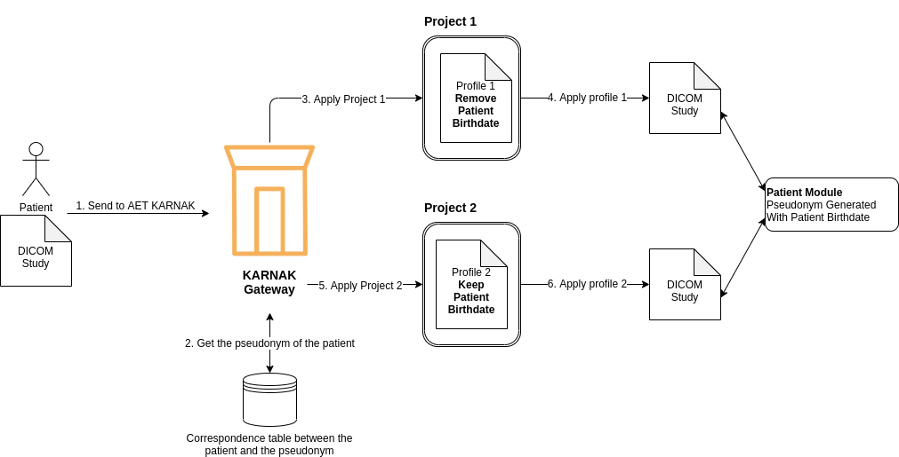
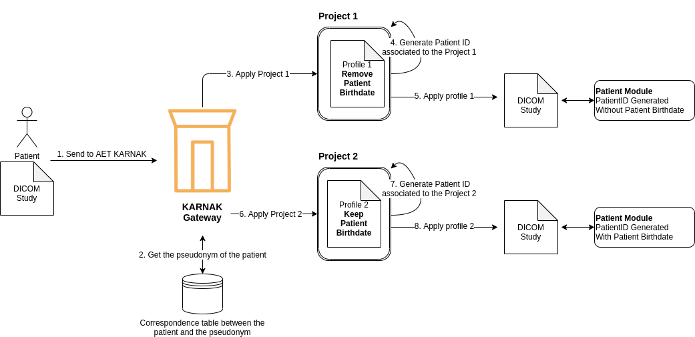

KARNAK is a gateway for sending DICOM files to one or multiple Application Entity Title (AET).KARNAK
offers the possibility to configure multiple destination for an AET.
These destinations can communicate with the DICOM or DICOM WEB protocol.

Besides different configurations of the destination like the DICOM endpoint or the credentials, it’s
possible to assign a project to a destination.

A project defined the de-idenfication method and a secret that will be used for generate random
values as UID or the shift date.

The reference profile of de-identification is given by
the [DICOM standard](hehttp://dicom.nema.org/medical/dicom/current/output/chtml/part15/chapter_E.html)
. This profile offer an exhaustive list of DICOM tags to manage to allow the de-identification of
the instance.

To manage the tags defined, the Basic Prof. offer 5 actions to be carried out.

* D – Replace with a dummy value
* Z – Set to null
* X – Remove
* K – Keep
* U – Replace with a new UID

The Basic Profile assigns one or more actions to a list of Tags. The multiple actions, show below,
is propose to avoid the DICOM corruption. For example
the [DICOM's type](http://dicom.nema.org/dicom/2013/output/chtml/part05/sect_7.4.html) can evolve
with
the [Information Object Definiton (IOD)](http://dicom.nema.org/medical/dicom/current/output/chtml/part04/chapter_6.html)
of the instance. This mean that an action like REMOVE can’t be applied on a Type 1 or Type 2 of the
tag.

* Z/D – Z unless D is required to maintain IOD conformance (Type 2 versus Type 1)
* X/Z – X unless Z is required to maintain IOD conformance (Type 3 versus Type 2)
* X/D – X unless Z is required to maintain IOD conformance (Type 3 versus Type 1)
* X/Z/D – X unless Z or D is required to maintain IOD conformance (Type 3 versus Type 2 versus Type
  1)
* X/Z/U* – X unless Z or replacement of contained instance UIDs (U) is required to maintain IOD
  conformance (Type 3 versus Type 2 versus Type 1 sequences containing UID references)

For the moment KARNAK does not know the IOD structure and therefore the types of tags that it must
process, we decided to assign the strictest action to the Tag when a multiple action is offered to
us (U/D > Z > X). Below is the action which is applied when multiple actions are proposed by the
Basic Profile

* Z/D, X/D, X/Z/D → apply action D
* X/Z → apply action Z
* X/Z/U, X/Z/U* → apply action U

## Action D without dummy value

The action D must replace the Tag’s field with a dummy value. This field must be consistent with
the [Value Representation](http://dicom.nema.org/medical/dicom/current/output/chtml/part05/sect_6.2.html) (
VR) of the Tag.

KARNAK will use a default value by VR in this case.

* AE, CS, LO, LT, PN, SH, ST, UN, UT, UC, UR → “UNKNOWN”
* DS, IS → “0”
* AS, DA, DT, TM → shiftRange(), the generation of a date will be explained below, **Shift Date,
  Generate a random date**
* UI → Action U, the generation of a new UID will be explained below, see **Action U, Generate a new
  UID**.

The *shiftRange()* gives random value between a given max days and seconds. By default the max days
defined is **365** and the max seconds is **86400**.

The following VRs *FL, FD, SL, SS, UL, US* are of type Binary. By default KARNAK will set to null
the value of this VR.

## Action U, Generate a new UID

For each U action, KARNAK will hash the input value. A one-way function is created to ensure that it
is not possible to revert to the original UID. This function will hash the input UID and generate a
UID from the hashed input.

### Context

It’s possible for a DICOM study to be de-identified several times and in different ways. This means
that if a study is de-identified with specific characteristics, it will not be the same as if it is
de-identified with other characteristics. So for each way to de-identified, a new UID will be
generated even if it is the same input study.

To ensure UID generation by de-identification method, a project will be associate to the
destination. In KARNAK, a project must be create to use the de-idenfication. A project defined a
de-idenfication method and a secret generate randomly or import by the user. **The project's secret
will be use as key for the HMAC.**

#### Project secret

**The secret is 16 bytes** defined randomly when the project is created.

An user can upload his own secret, but the uploaded secret must be 16 bytes. To allow easy uploading
of secrets to the user, KARNAK offers to upload it in hexadecimal.

### Hash function

The algorithm used for hashing is the “Message Authentication Code” (MAC). KARNAK used the MAC, not
as message authentication, but as a one-way function. A definition, coming from
the [JAVA Mac class](https://docs.oracle.com/en/java/javase/14/docs/api/java.base/javax/crypto/Mac.html)
used, is proposed to you here below:

«*A MAC provides a way to check the integrity of information transmitted over or stored in an
unreliable medium, based on a secret key. Typically, message authentication codes are used between
two parties that share a secret key in order to validate information transmitted between these
parties.*

*A MAC mechanism that is based on cryptographic hash functions is referred to as HMAC. HMAC can be
used with any cryptographic hash function, e.g., SHA256 or SHA384, in combination with a secret
shared key. HMAC is specified in RFC 2104.*»

For each use of the HMAC, it uses the **SHA256** hash function **with a project's secret given**.

### Generate UID

“*What DICOM calls a "UID" is referred to in the ISO OSI world as an Object Identifier(OID)*”[1] To
generate the new DICOM UID, KARNAK will create an OID that begins with “2.25” (is an OID encoded
UUID). “*The value after "2.25." is the straight decimal encoding of the UUID as an integer. It MUST
be a direct decimal encoding of the single integer, all 128 bits.*”[2]

[1]: <https://www.dclunie.com/medical-image-faq/html/part2.html>

[2]: https://wiki.ihe.net/index.php/Creating_Unique_IDs_-_OID_and_UUID "How do you create an OID ?"

The generated UUID will use the first 16 octet (128 bit) from the hash value. The UUID is a type 4
with a variant 1. See below the pseudo-code to ensure the type and the variant are correct in the
UUID:

```
// Version
uuid[6] &= 0x0F
uuid[6] |= 0x40

// Variant
uuid[8] &= 0x3F
uuid[8] != 0x80
```

The hashed value will be converted in a positive decimal and added at the root of the OID separated
by a dot. See the example below:

```
OID_ROOT = “2.25”
uuid = OID_ROOT + “.” + HashedValue[0:16].toPositiveDecimal()
```

## Shift Date, Generate a random date

KARNAK offer the possibility of shifting a date randomly. This shift must be the same in the context
of the project and **for the patient**. For example, if a random shift is made for the birthdate of
the patient "José Santos", it must be the same for each instance associate to "José Santos", even if
the instance is loaded later.

The random shift date will use the HMAC defined above and a scale days or seconds given by the user.
If the scaled minimum isn't given, it will be set to 0.

As the HMAC needs a value for the hash, the patientID will be used to ensure date consistency by
patient.

See the code below to show how KARNAK will generate a random value between a minimum (inclusive) and
maximum (exclusive) given.

```
scaleHash(PatientID, scaledMin, scaledMax):
    patientHashed = hmac.hash(PatientID)
    scale = scaledMax - scaledMin

    shift = (patientHashed[0:6].toPositiveDecimal() * scale) + scaledMin
```

## Pseudonym

This chapter will explain the problem with a pseudonym defined for different de-identifications
method, how KARNAK generated a PatientID per project and where the pseudonym will be stored in the
DICOM study.

To allow a patient to participate in several studies requiring different de-identification, KARNAK
generates a PatientID depending on the context.

Pseudonym generation is usually done for a patient, independent of de-identification. Depending on
the project or the clinical research, the de-identification can ask to keep the year of birth or to
delete it. There is a problem of consistency between pseudonymization and de-identification. In
DICOM a patient is a module, like a block of metadata, the following link is the information module
definition of
the [Patient Modules](http://dicom.nema.org/medical/dicom/current/output/chtml/part03/sect_C.2.html)
.

As shown in the Standard DICOM, the patient modules contains a lot of metadata about the information
patient. In KARNAK, the patient won't be attached at only one definition of his metadata.

The following illustration show the problem with the patient module. A patient send a DICOM study to
be de-identified twice. The first de-identification will remove the patient birth date (*3. apply
Project 1*) and the second will keep it  (*5. apply Project 2*) . The PatientID won't be generated
by KARNAK, but will be the pseudonym given. As illustrated the Patient Module will be shared with
the two DICOM study because the PatientID is the same. Depending to the Picture Archiving and
Communication System (PACS) the patient module will be updated with new value or not.



The second illustration show the same de-identification for the patient, but the KARNAK will
generate a PatientID associated to the project. With this PatientID generated the patient module
will be shared with the DICOM study who have been de-identified by the same project. The generation
of the PatientID will be explain below, see chapter **PatientID generation**.



### PatientID generation

KARNAK will generate a Patient ID to resolve the problem explain above. The Patient ID generated
will use the HMAC function defined in the context of a project, see chapter **Action U, Generate a
new UID** for more details about the project and the HMAC function.

The Pseudonym given will be hashed and convert to hexadecimal to be used as Patient ID for the study
DICOM de-identified.

The generated Patient ID will use the first 16 octet (128 bit) from the hashed pseudonym. The hashed
pseudonym will be converted in a positive decimal and in hexadecimal.

The hexadecimal generated from the pseudonym hashed will be used for the attributes Patient ID and
for the Patient Name (In case the user has not defined to use the pseudonym as Patient Name).

### Keep the correspondence between pseudonym and patient

This part will explain which tags will be used to keep the correspondence between the pseudonym
given and the patient. It's important for the user to know where he needs to look this information
in the event that he needs to find the real patient.

As explained above, the Patient ID in the DICOM study de-identified won't be the pseudonym but will
a hexadecimal generated from the pseudonym hashed. This ID does not allow the patient to be found in
the patient / pseudonym correspondence table.

The pseudonym will be stored in the attribute **Clinical Trial Subject ID** **(0012,0040)**

#### Clinical Trial Subect ID

"*The Clinical Trial Subject ID (0012,0040) identifies the subject within the investigational
protocol specified by Clinical Trial Protocol ID (0012,0020).*" [3]

[3]: http://dicom.nema.org/medical/dicom/current/output/chtml/part03/sect_C.7.html#sect_C.7.1.3.1.6

The attribute *ClinicalTrialSubjectID* comes from the module [*Clinical Trial Subject
Module*](http://dicom.nema.org/medical/dicom/current/output/chtml/part03/sect_C.7.html#sect_C.7.1.3)
. To avoid generating invalid DICOMs, other attributes will be added for this module to be valid,
see *Clinical Trial Subject Module* below.

## Attributes added by KARNAK

This chapter explains which attributes are added by KARNAK during de-identification.

### Patient Module

This section lists the attributes changed or added by KARNAK in
the [Patient Module](http://dicom.nema.org/medical/dicom/current/output/chtml/part03/sect_C.7.html#sect_C.7.1.1)
. The way the Patient ID is generated is explained above in the *Pseudonym* chapter.

* **Patient ID (0010,0020)**, this attribute will contain a **hexadecimal generated from the
  pseudonym hashed**.

* **Patient Name (0010,0010)** this attribute will contain the value of the **PatientID or the
  pseudonym**. (This choice is defined by the user)

* **Patient Identity Removed (0012,0062)** this attribute will contain the value **YES**
* **De-identification Method (0012,0063)** this attribute will contain the **profile pipe codename**

The profile pipe codename, is the codenames used in a profile concatenated by a "-". For example the
profile that use the profile codename *clean.pixel.data* and *basic.dicom.profile*, the profile pipe
codename will be *clean.pixel.data-basic.dicom.profile*.

### Clinical Trial Subject Module

This section will explain how KARNAK defined the attributes in the [*Clinical Trial Subject
Module*](http://dicom.nema.org/medical/dicom/current/output/chtml/part03/sect_C.7.html#sect_C.7.1.3)
.

The following list, is the attribute added by KARNAK:

* **Clinical Trial Sponsor Name (0012,0010)**, required
* **Clinical Trial Protocol ID (0012,0020)**, required
* **Clinical Trial Protocol Name (0012,0021**), required, empty if unknown
* **Clinical Trial Site ID (0012,0030)**, required, empty if unknown
* **Clinical Trial Site Name (0012,0031)**, required, empty if unknown
* **Clinical Trial Subject ID (0012,0040)**, shall be present if Clinical Trial Subject Reading ID (
  0012,0042) is absent.

In the near future this list of attributes could be managed by the user when initializing or editing
a project, except for *Clinical Trial Subject ID* that will always contains the pseudonym.

But currently these values are automatically filled in by KARNAK as below.

* Clinical Trial Sponsor Name (0012,0010) will contain the **profile pipe codename**
* Clinical Trial Protocol ID (0012,0020) will contain the **profile name**
* Clinical Trial Protocol Name (0012,0021) will contain ***null***
* Clinical Trial Site ID (0012,0030) will contain ***null***
* Clinical Trial Site Name (0012,0031) will contain ***null***
* Clinical Trial Subject ID (0012,0040) will contain the **pseudonym**.

The profile pipe codename, is the codenames used in a profile concatenated by a "-". For example the
profile that use the profile codename *clean.pixel.data* and *basic.dicom.profile*, the profile pipe
codename will be *clean.pixel.data-basic.dicom.profile*.


